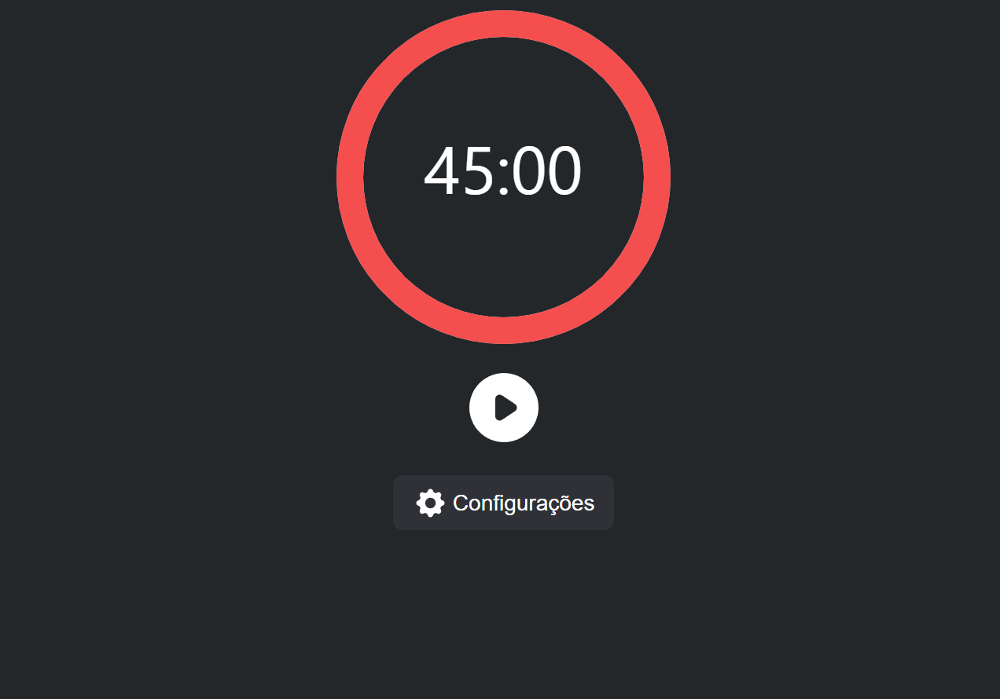

````markdown
# Pomodoro Clock

This React component is a digital implementation of the Pomodoro Technique, a time management method that encourages people to work with the time they have—rather than against it.



## Features:

1. **Work and Break Intervals:** Alternates between work and break intervals. Once a work interval ends, a break interval begins automatically.
2. **Pause & Resume:** Allows users to pause the timer and resume it as needed.
3. **Visual Feedback:** Uses a circular progress bar to provide visual feedback on how much time remains in the current interval.
4. **Dynamic Colors:** Changes colors based on the current interval - red for work and green for breaks.

## Installation:

1. Ensure `react` and `react-dom` are installed in your project.
2. Install the required package:
   ```bash
   npm install react-circular-progressbar
   ```
````

3. Clone or copy the Pomodoro Clock component into your project.

## Usage:

To integrate the Pomodoro Clock in your React application:

```jsx
import Timer from "./Timer";

function App() {
  return (
    <div>
      <Timer />
    </div>
  );
}
```

## Customization:

The Pomodoro Clock uses the `SettingsContext` for its configurations. You can adjust the work/break intervals or other settings through this context. If your application has a different context structure or state management, you may need to adjust the Pomodoro Clock component accordingly.

## Acknowledgment:

The Pomodoro Technique® and Pomodoro™ are registered and filed trademarks by Francesco Cirillo. This implementation is not affiliated or associated with or endorsed by Pomodoro®, Pomodoro Technique® or Francesco Cirillo.

## License:

This component is distributed under the MIT License.

---

Developed with ❤️ by Felipe Machado https://github.com/FelipeWSMachado/

```

```
